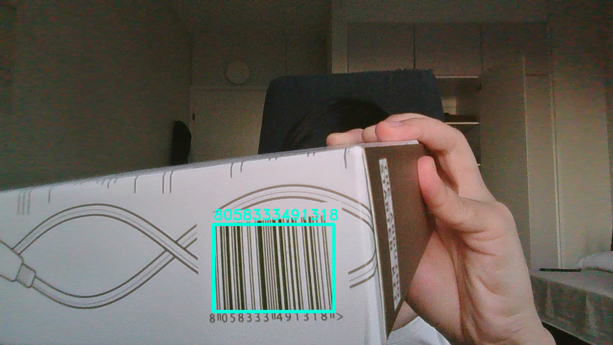
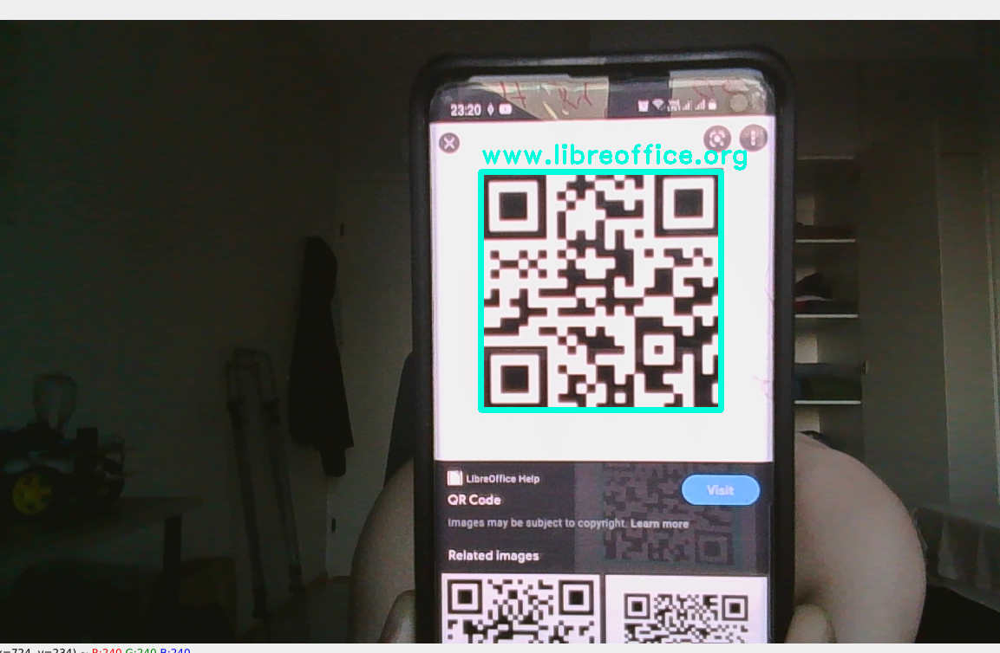

# QR Code reader


This repo using pyzbar library with opencv to read both QR and barcode. However, if you only want to read QRCode, you can simply use the built-in function in openCV _(QRCodeDetector)_. 

There are 2 modes in the project:
- __stream:__ real time detect via video
- __image:__ detect on an input image

Detected code will be displayed with a message (text) over the bounding box.

<p float="left">
  
   
</p>

## Environment
- Ubuntu 20.04 _(runnable on Raspberry Pi)_
- Python 3.7

## Requirements
- OpenCV
- Pyzbar

## Usage

**IMPORTANT:** Remember to install _libzbar0_ first, otherwise it will get error when running
```
sudo apt-get install libzbar0
```
**Arguments parser**
```
'--mode', '-m', 
    choices=['stream', 'image'],
    type=str, 
    description='choose detect mode: on streaming video or on single image')
'--img', '-i':  
    type=str
    description='image path'
'--rate', '-r':
    description:'Call read QR/Bar code after this number of frames'
    default: 1
```

**Install all libraries**

**Run the program**

_With image_
```
python run.py -m image -i test.png
```

_Stream video_
```
python run.py -m stream
```